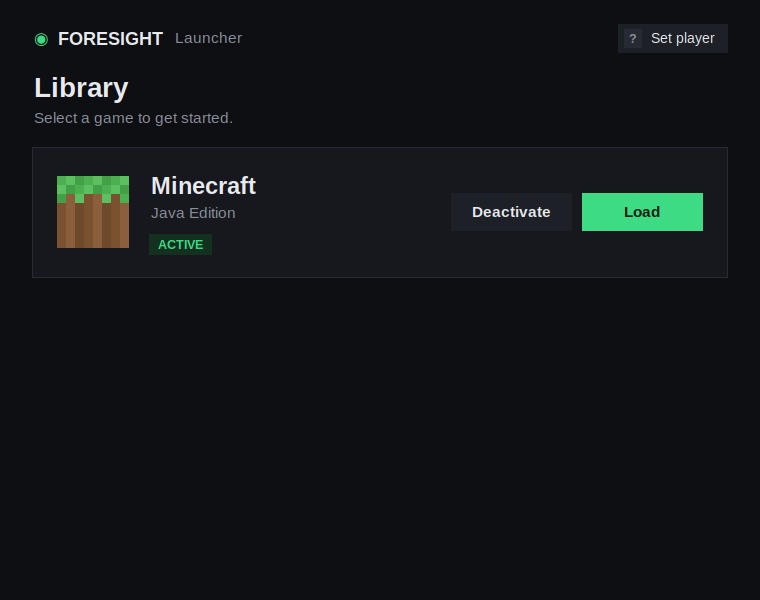
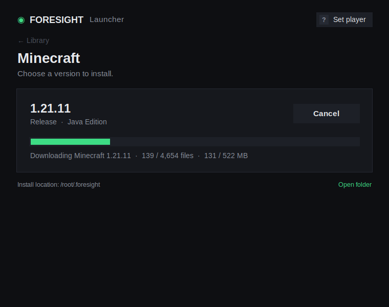
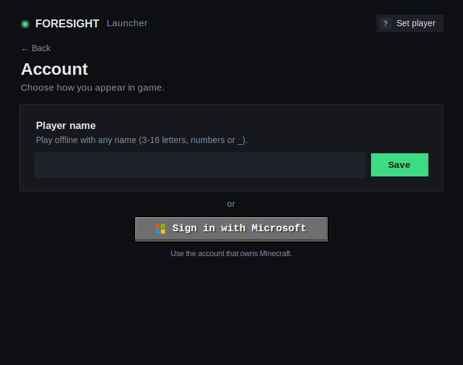
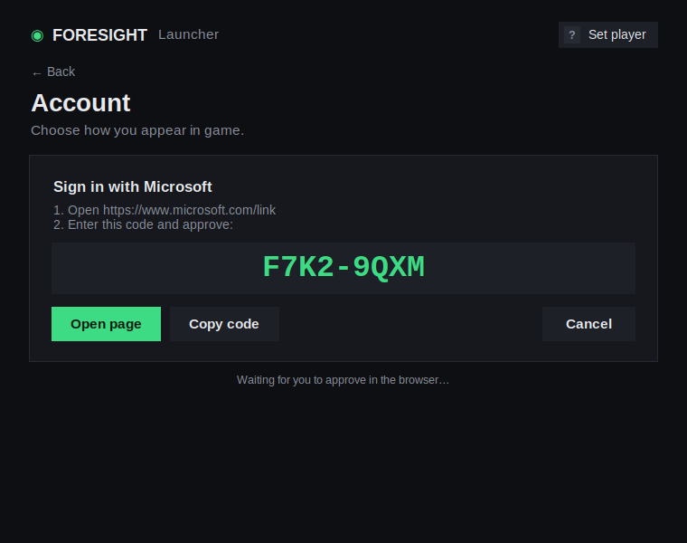

# Foresight

A simple, minimal Minecraft: Java Edition launcher.

**See it in your browser:** open [`docs/preview.html`](docs/preview.html), an interactive
mock-up of every screen (downloads and sign-in are simulated there).

| Library | Version |
|---|---|
|  |  |

## How it works

1. **Library**: the Minecraft card. Press **Activate**, then **Load**.
2. **Version**: shows **1.21.11**. Press **Load** to download every file the
   game needs. You can cancel at any time and pressing Load again resumes.
3. **Account**: click the chip in the top-right corner (**Set player**).

## Account

| Choose a name or sign in | Microsoft sign-in |
|---|---|
|  |  |

* **Player name**: type any name (3-16 letters, numbers or `_`) and press
  **Save**. This is an offline player. The UUID is generated the same way the
  game does for offline players.
* **Sign in with Microsoft** (the Minecraft-style button): Foresight shows a
  short code and opens `microsoft.com/link`. Enter the code and approve, and
  the launcher signs you in through Microsoft → Xbox Live → Minecraft and
  shows your real Minecraft name. It checks that the account owns
  Java Edition.

### Enabling Microsoft sign-in

Microsoft only allows Minecraft sign-in through an app ID that Mojang has
approved, so each launcher needs its own:

1. In the [Azure portal](https://portal.azure.com) → *App registrations* →
   *New registration*. Choose **Personal Microsoft accounts only**.
2. Under *Authentication*, set **Allow public client flows** to **Yes**.
3. Request Minecraft API access for that app ID from Mojang
   (form: <https://aka.ms/mce-reviewappid>). Until it's approved, sign-in
   stops with "This app ID isn't approved for the Minecraft API yet".
4. Give Foresight the *Application (client) ID*, either as an environment
   variable `FORESIGHT_MS_CLIENT_ID=<id>` or as `"ms_client_id": "<id>"` in
   `launcher.json` inside the install folder.

The chosen account is saved in `launcher.json`. For Microsoft accounts this
includes a refresh token so you stay signed in, so keep that file private
(on macOS/Linux it is written with owner-only permissions). **Sign out**
removes it.

What gets downloaded (all from Mojang's official servers, every file
SHA-1 verified):

| What | Where |
|---|---|
| Version JSON + client jar | `versions/1.21.11/` |
| Libraries (incl. natives for your OS) | `libraries/` |
| Asset index + ~4,600 asset objects | `assets/indexes/`, `assets/objects/` |
| Logging config | `assets/log_configs/` |

About 530 MB in total. The layout matches the vanilla `.minecraft` folder.
Files that are already present and valid are skipped, so re-running only
re-verifies.

Install location (separate from your official `.minecraft`):

| OS | Path |
|---|---|
| Windows | `%APPDATA%\.foresight` |
| macOS | `~/Library/Application Support/foresight` |
| Linux | `~/.foresight` |

## Run

Requires Python 3.10+ and nothing else (standard library only, UI is tkinter).

```
python -m foresight
```

Terminal-only download:

```
python -m foresight --no-gui --version 1.21.11 --dir ./mc
```

Tests:

```
python -m unittest discover -s tests
```

> On Linux, tkinter may need `sudo apt install python3-tk`.

## Project layout

| Path | Purpose |
|---|---|
| `foresight/minecraft.py` | Download engine: manifest, libraries, assets, parallel downloads, checksums, retries. |
| `foresight/app.py` | Launcher UI (Library, Version and Account screens). |
| `foresight/auth.py` | Offline player names and Microsoft → Xbox → Minecraft sign-in. |
| `foresight/__main__.py` | Entry point and `--no-gui` mode. |
| `tests/` | Unit tests for downloads and accounts (sign-in flow is mocked). |

## Not yet included

* Starting the game (needs a Java 21 runtime; the account is ready for it).
* Other versions; the engine supports any version ID, the UI shows 1.21.11.
